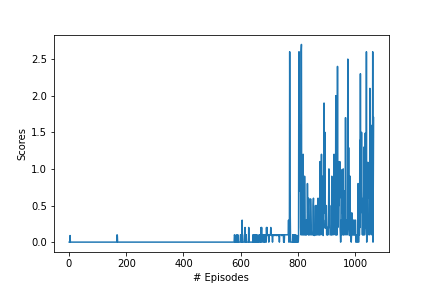
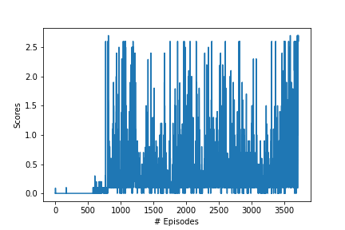

Author: [Fares El Kahla](https://github.com/faresbkh) 

The aim of this project is to explore the application of the Multi-Agent Deep Deterministic Policy Gradient (MADDPG) algorithm in the context of Reinforcement Learning (RL). Specifically, we will focus on using MADDPG to learn an optimal policy for controlling two agents in the Tennis Unity environment. This environment involves a continuous state space and requires the agents to move their rackets to hit a ball back and forth. The agents have a continuous action space which consists of two dimensions representing the movement towards the net or away from it, and jumping or not.

MADDPG is an extension of the DDPG algorithm to multi-agent systems. In MADDPG, each agent learns a local policy that interacts with its own environment, while also taking into account the policies of other agents. By using two neural networks, one for the actor and one for the critic, MADDPG is able to learn a continuous policy from raw sensory inputs for each agent. In this project, we aim to demonstrate the ability of MADDPG to learn a suitable policy in the Tennis Unity environment.

This report provides an overview of the implementation of MADDPG on the Tennis Unity environment, including details on the design and architecture of the algorithm, as well as a discussion of the results obtained. The report concludes with some reflections on the strengths and limitations of the method, as well as suggestions for future work.

The following report is written in four parts:

- **Implementation**
- **HyperParameters**
- **Results**
- **Ideas for improvement** 

## Implementation

The Tennis Unity environment is similar to the 20-agent Reacher Unity environment in that it involves a continuous state space and requires agents to learn a policy to move their rackets to hit a ball over a net. Like the Reacher environment, the Tennis environment is a continuous control problem, with the agents having a continuous action space that represents the movement of their rackets in two dimensions.

In the Tennis environment, two agents are playing against each other, and the goal is for the agents to keep the ball in play for as long as possible. The reward function is such that each agent receives a reward of +0.1 if it hits the ball over the net, and a reward of -0.01 if the ball hits the ground or goes out of bounds. Therefore, the success of one agent is not only dependent on its own actions but also on the actions of its opponent. If an agent hits the ball over the net, but its opponent fails to return the ball, then the agent will receive a reward of +0.1, and vice versa. This means that the success of a single agent is directly tied to the success of its opponent, and ultimately the success of both agents working together to keep the ball in play.

Therefore, the Multi-Agent Deep Deterministic Policy Gradient (MADDPG) algorithm, which was developed specifically for training multiple agents in a cooperative setting, is a natural choice for the Tennis environment. MADDPG utilizes a centralized critic and decentralized actor approach to learning, in which each agent's policy is learned based on its own observations, but the critic learns a centralized value function that takes into account the actions of all agents. This approach allows the agents to learn to cooperate with each other, leading to more effective and efficient learning.

In the initial implementation of the DDPG algorithm on the Tennis environment, the Ornstein-Uhlenbeck (OU) process was used to introduce noise in the exploration of the action space. However, it was found that the OU process was not efficient in promoting convergence, and it was causing the algorithm to get stuck in local optima. As a result, the OU process was removed, and dropout was introduced in the actor model to introduce noise. Dropout is a regularization technique that randomly drops out neurons during training, which helps to prevent overfitting and introduces noise in the output. By using dropout instead of the OU process, the DDPG algorithm was able to explore the action space more efficiently and achieve better convergence.

In this implementation, both the state and action are added to all hidden layers of the critic model, allowing for the complex nonlinear relationships between state and action to be more accurately captured. This modification improved the convergence of the algorithm and resulted in better performance in the Tennis Unity environment.

  ### Hyperparameters

  There were many hyperparameters involved in the experiment. The value of each of them is given below:

  | Hyperparameter                      | Value |
  | ----------------------------------- | ----- |
  | Replay buffer size                  | 1e6   |
  | Batch size                          | 128   |
  | $\gamma$ (discount factor)          | 0.99  |
  | $\tau$                              | 1e-3  |
  | Learning rate actor                 | 1e-4  |
  | Learning rate critic                | 1e-3  |
  | Number of episodes                  | 5000  |
  | Max number of timesteps per episode | 1000  |
  | Activation function                 | relu  |
  | Hidden layers actor                 |   2   |
  | Hidden layers units actor           |  256  |
  | Dropout layer actor                 |  0.2  |
  | Hidden layers units actor           |  128  |
  | Hidden layers critic                |   3   |
  | Hidden layers units critic          |  512  |
  | Hidden layers units critic          |  256  |
  | Batch normalisation layer 2 critic  |  True |
  | Hidden layers units critic          |  128  |

 ### Results
The model achieved +0.5 average score over 100 episodes in 964 episodes and +1.0 average score over 100 episodes in 3614 episodes. Unlike the mentioned unrecoverable dips in score for the model in the assignment, the current implementation was robus enough to recover and eventually reach 1.0 score

|  MADDPG 0.5 score |  MADDPG 1.0 score |
| --------------------------------------------------- | ---------------------------------- |
|  | 

### Ideas for improvement

* Prioritized Experience Replay: Similar to the DQN algorithm, the DDPG algorithm can also benefit from prioritized experience replay. Prioritizing experiences that are more important for learning can help the agent to learn more efficiently and achieve better performance. This can be achieved by prioritizing experiences based on their TD error or other measures of their importance.
  
* Use of another algorithm : For example, one such algorithm is the Multi-Agent Actor-Critic with Communication (MAAC) algorithm. The MAAC algorithm extends the traditional actor-critic method by introducing a communication mechanism between the agents. The communication is implemented through a centralized critic network that takes as input the joint state and action of all agents and outputs the state-action value function. The agents use this information to update their individual policies.

* Hyperparameter Tuning: The performance of the DDPG algorithm can be highly dependent on the values of its hyperparameters. Experimenting with different values of hyperparameters, such as the learning rate, discount factor, and noise parameters, can help to find the optimal values.